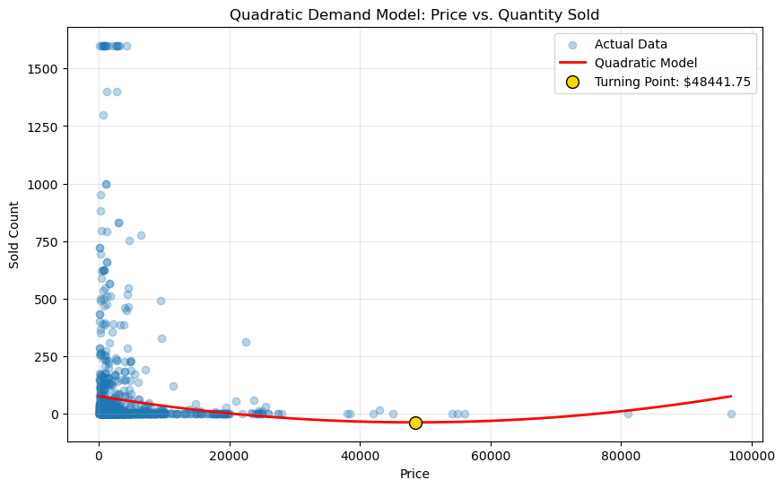
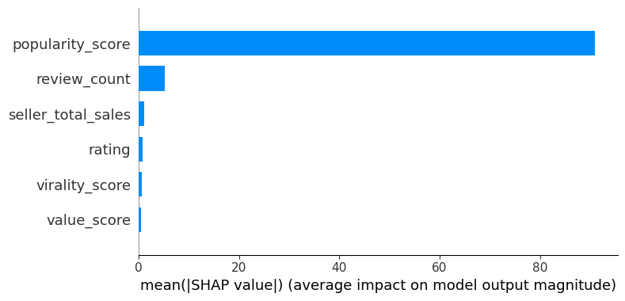
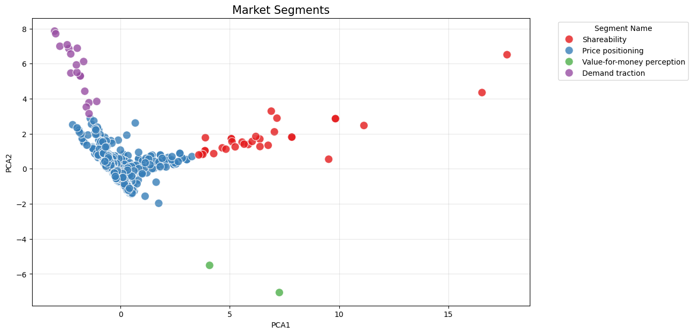

<div align="center">

# 🎙️ Pakistan E-Commerce Microphone Market Intelligence

### Pricing Strategy · Demand Modelling · Explainable AI · Market Segmentation

**A commercial analytics framework for understanding price sensitivity, demand drivers, seller competitiveness, promotional effectiveness, and revenue opportunities in Pakistan's online microphone market.**

<br>


</div>

---

## Executive Summary

Pakistan's online microphone market serves a diverse customer base ranging from casual consumers to content creators, streamers, podcasters, musicians, and professional audio users.

This analysis converts marketplace data into **decision-oriented pricing and demand intelligence**.

Using econometrics, machine learning, explainable AI, and market segmentation, the analysis evaluates how pricing, product characteristics, seller positioning, ratings, discounts, and other marketplace variables relate to sales performance.

The objective is to support commercial decisions around:

- Pricing strategy
- Revenue optimisation
- Seller benchmarking
- Promotional effectiveness
- Product positioning
- Demand estimation
- Market segmentation

The analytical workflow moves beyond descriptive reporting by combining **statistical inference, predictive modelling, explainability, and business interpretation**.

---

#  Key Commercial Findings

| Indicator | Result |
|---|---:|
| Marketplace records analysed | **1,360** |
| Total units sold | **83,832** |
| Estimated marketplace revenue | **PKR 162.0M** |
| Average product price | **PKR 3,680.70** |
| Estimated price elasticity | **-0.34** |
| Seller/product-effects model R² | **0.689** |
| XGBoost reported R² | **0.996** |
| XGBoost reported MAE | **2.24 units** |
| Estimated revenue-maximising price | **PKR 4,784.91** |

> **Commercial takeaway:** demand appears relatively price inelastic within the observed market, while seller positioning, product value, and broader marketplace characteristics contribute materially to sales performance.

---

#  Commercial Questions

The analysis addresses six practical business questions:

1. **How price-sensitive is demand?**
2. **Which marketplace variables are most strongly associated with sales?**
3. **Do larger discounts materially improve demand?**
4. **How important are seller and product-positioning effects?**
5. **Which price points may offer stronger revenue potential?**
6. **Can products and sellers be grouped into commercially meaningful market segments?**

---

#  Analytical Framework

```text
Raw E-Commerce Data
        │
        ▼
Data Cleaning & Validation
        │
        ▼
Market & Seller Analysis
        │
        ▼
Feature Engineering
        │
        ├── Pricing Variables
        ├── Product Characteristics
        ├── Seller Variables
        └── Value / Rating Metrics
        │
        ▼
Econometric Analysis
        │
        ├── Price Elasticity
        ├── Seller Effects
        └── Discount Analysis
        │
        ▼
XGBoost Demand Modelling
        │
        ▼
Hyperparameter Optimisation
        │
        ▼
SHAP Explainability
        │
        ▼
KMeans Market Segmentation
        │
        ▼
Revenue Optimisation
        │
        ▼
Commercial Pricing Intelligence
```

---

#  Pricing & Demand Elasticity

A log-log demand model was used to estimate how sales respond to changes in price.

### Estimated Price Elasticity

# **-0.34**

| Econometric Metric | Result |
|---|---:|
| Price elasticity coefficient | **-0.3447** |
| Statistical significance | **p < 0.001** |
| 95% confidence interval | **[-0.430, -0.259]** |
| Observations | **1,360** |

The estimated elasticity indicates **relatively inelastic demand** within the observed marketplace.

A 1% increase in price is associated with an estimated **0.34% decrease in quantity sold**, holding the interpretation of the fitted model constant.

From a commercial perspective, this suggests that demand does not decline proportionally with price increases across the analysed market.



### Business Interpretation

Pricing decisions should not be based on elasticity alone. Product quality, seller position, ratings, competition, and value perception also influence demand.

The relatively low elasticity nevertheless suggests that some sellers may have greater pricing flexibility than would be expected in a highly price-sensitive marketplace.

---

#  Seller & Product Effects

A richer econometric specification was used to evaluate sales after accounting for seller and product characteristics.

### Model Performance

| Metric | Result |
|---|---:|
| R² | **0.689** |
| Adjusted R² | **0.687** |
| Overall significance | **p < 0.001** |
| Observations | **1,360** |

The model explains a substantially larger proportion of sales variation than price alone.

### Key Implication

Demand appears to depend on more than price.

Seller characteristics, perceived value, ratings, and product positioning contribute meaningfully to marketplace performance.

This matters commercially because competing purely on price may overlook other drivers capable of strengthening sales.

---

#  Promotional Effectiveness

Discounting was tested as a potential driver of demand.

The estimated discount effect was comparatively weak after other marketplace characteristics were considered.

At the conventional 5% significance threshold, discount percentage was not statistically significant in the fitted seller-effects model.

### Discount × Rating Interaction

The interaction between discounting and product rating was also not statistically significant.

This suggests that:

> **Increasing the advertised discount does not automatically compensate for weaker product positioning or lower perceived quality.**

For commercial teams, the result supports a **selective promotional strategy** instead of assuming that deeper markdowns will necessarily generate proportionally stronger sales.

---

#  Machine Learning Demand Model

An **XGBoost regression model** was developed to capture nonlinear relationships between marketplace characteristics and product sales.

The modelling workflow included:

```text
Feature Engineering
        ↓
Train / Test Split
        ↓
Baseline XGBoost
        ↓
GridSearchCV
        ↓
Hyperparameter Selection
        ↓
Model Evaluation
        ↓
Demand Predictions
        ↓
SHAP Explainability
```

### Reported Performance

| Metric | Result |
|---|---:|
| R² | **0.996** |
| MAE | **2.24 units** |

The reported results indicate a strong fit within the current modelling setup.

However, high predictive performance is treated cautiously and should be validated against potential leakage, correlated aggregate features, and performance on fully unseen marketplace data before production deployment.

---

# Explainable Machine Learning

High predictive accuracy is only commercially useful when stakeholders can understand **what is driving predictions**.

SHAP analysis was therefore used to explain feature contributions within the XGBoost demand model.



### Why Explainability Matters

SHAP helps translate the demand model from a black-box prediction system into a more interpretable commercial tool.

It allows decision-makers to investigate:

- Which attributes contribute most strongly to predicted demand
- Whether price is the dominant driver
- How seller-level variables affect predictions
- Which product characteristics create stronger sales signals
- Where pricing decisions should be considered alongside non-price factors

---

#  Market Segmentation

Not all marketplace products compete in the same way.

KMeans clustering was used to identify groups of products with similar commercial characteristics, while Principal Component Analysis was used to visualise the resulting market structure.



Segmentation provides a foundation for differentiated strategies rather than treating every microphone listing as part of one homogeneous market.

Potential applications include:

- Premium vs. value positioning
- Seller benchmarking
- Segment-specific pricing
- Targeted promotions
- Product assortment planning
- Competitive positioning

---

# Revenue Optimisation

The analysis extends demand modelling into pricing decision support.

Revenue is defined as:

```text
Revenue = Price × Expected Demand
```

Using the estimated demand relationship, expected revenue can be evaluated across alternative price points.

### Estimated Revenue-Maximising Price

# **PKR 4,784.91**

Compared with the observed average product price of approximately **PKR 3,680.70**, the model identifies a higher price point associated with stronger estimated revenue under the fitted demand relationship.

This should be interpreted as a **model-based pricing signal**, not as a universal recommended price for every microphone.

Actual pricing decisions should also consider:

- Product segment
- Brand positioning
- Seller reputation
- Competitive prices
- Inventory levels
- Customer ratings
- Product quality
- Marketplace fees and margins

---

#  Decision Implications

### Pricing

The estimated elasticity suggests that parts of the market may tolerate moderate price increases without proportional reductions in demand.

### Promotions

Larger discounts are not automatically associated with stronger demand once other marketplace characteristics are considered.

### Seller Strategy

Marketplace position and product-level value signals appear important, suggesting sellers should compete on more than price alone.

### Product Positioning

Market segmentation can support differentiated pricing and assortment strategies across commercially distinct groups.

### Machine Learning

Predictive modelling can identify complex demand patterns that are difficult to capture with simple linear relationships.

### Revenue Management

Combining estimated demand with alternative price scenarios creates a foundation for evidence-based pricing decisions.

---

# Model Risk & Validation

Commercial analytics should communicate uncertainty as clearly as opportunity.

Several considerations remain important:

- Econometric diagnostics indicate potential multicollinearity and scale sensitivity.
- Individual regression coefficients should therefore be interpreted cautiously.
- The very high XGBoost R² warrants additional validation for potential leakage or highly correlated aggregate predictors.
- Elasticity estimates represent the observed marketplace and should not automatically be transferred to every product or seller.
- Revenue optimisation assumes the estimated demand relationship remains stable across the evaluated price range.
- Marketplace behaviour can change as competition, supply, consumer preferences, and macroeconomic conditions evolve.

Further validation could include:

```text
Variance Inflation Factor analysis
Feature leakage review
Cross-validation
Out-of-time validation
Seller-level holdout testing
Feature scaling
Alternative econometric specifications
Sensitivity analysis
```

---

#  Technology Stack

| Area | Technology |
|---|---|
| Programming | **Python** |
| Data Manipulation | **Pandas, NumPy** |
| Visualisation | **Matplotlib, Seaborn** |
| Econometrics | **Statsmodels** |
| Machine Learning | **XGBoost** |
| Model Selection | **Scikit-learn, GridSearchCV** |
| Explainable AI | **SHAP** |
| Segmentation | **KMeans, PCA** |
| Development | **Jupyter Notebook** |
| Version Control | **Git & GitHub** |

---


#  Explore the Analysis

The complete notebook contains the underlying analytical workflow, including data preparation, econometric modelling, machine learning, SHAP analysis, segmentation, and revenue optimisation.

### ▶️ [View the Full Analysis Notebook](notebooks/pakistan-s-e-commerce-microphone-market.ipynb)

---

#  Running the Analysis

Clone the repository:

```bash
git clone https://github.com/jaizcollins/Pakistan-s-E-Commerce-Microphone-Market.git
```

Move into the repository:

```bash
cd Pakistan-s-E-Commerce-Microphone-Market
```

Install dependencies:

```bash
pip install -r requirements.txt
```

Launch Jupyter:

```bash
jupyter notebook
```

Then open:

```text
notebooks/pakistan-s-e-commerce-microphone-market.ipynb
```

---

#  Commercial Extensions

The analytical framework can be extended into a more complete marketplace intelligence platform through:

- Dynamic pricing recommendations
- Seller-specific elasticity models
- Brand-level pricing intelligence
- Competitor price monitoring
- Automated price alerts
- Product-level demand prediction
- SHAP-based decision dashboards
- Margin-aware revenue optimisation
- Review sentiment analysis
- Inventory optimisation
- Interactive Power BI or Tableau dashboards
- Production API deployment
- Automated marketplace data pipelines

---

# Capabilities Demonstrated

`Commercial Analytics` · `Pricing Analytics` · `Econometrics` · `Machine Learning` · `XGBoost` · `Explainable AI` · `SHAP` · `Market Segmentation` · `Revenue Optimisation` · `Python` · `Statistical Modelling` · `Data Visualisation` · `Business Intelligence`

---

<div align="center">

## Jaiz Collins

### Data Analytics · Machine Learning · Pricing Intelligence

**Turning marketplace data into actionable commercial decisions.**

</div>
